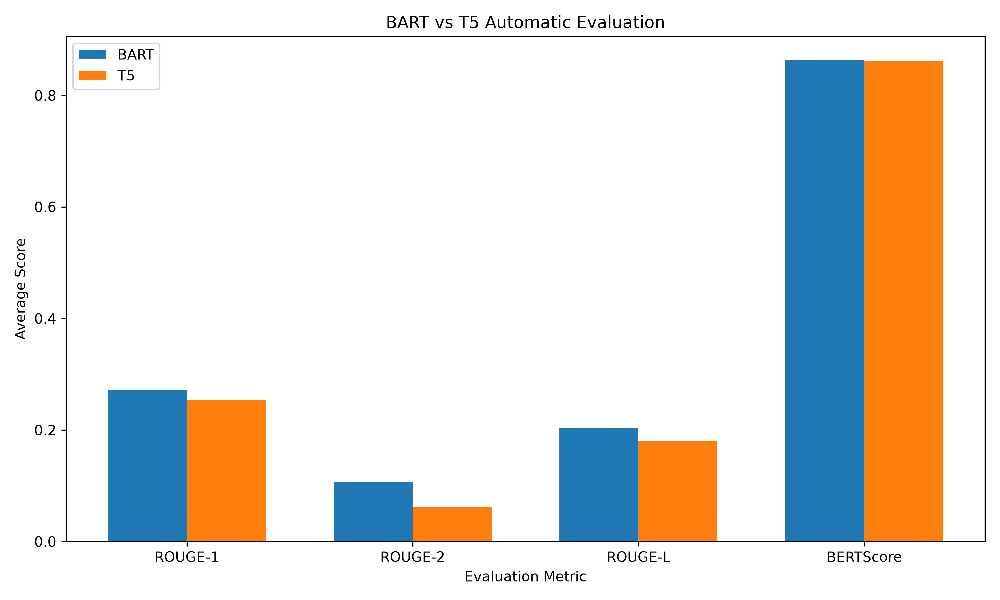
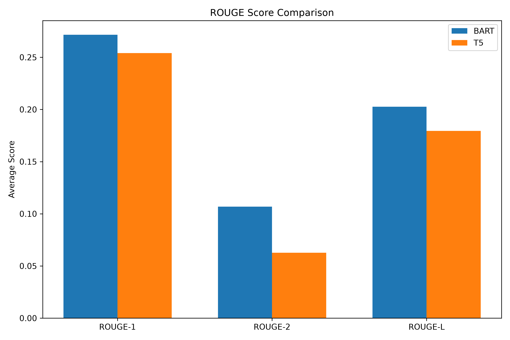
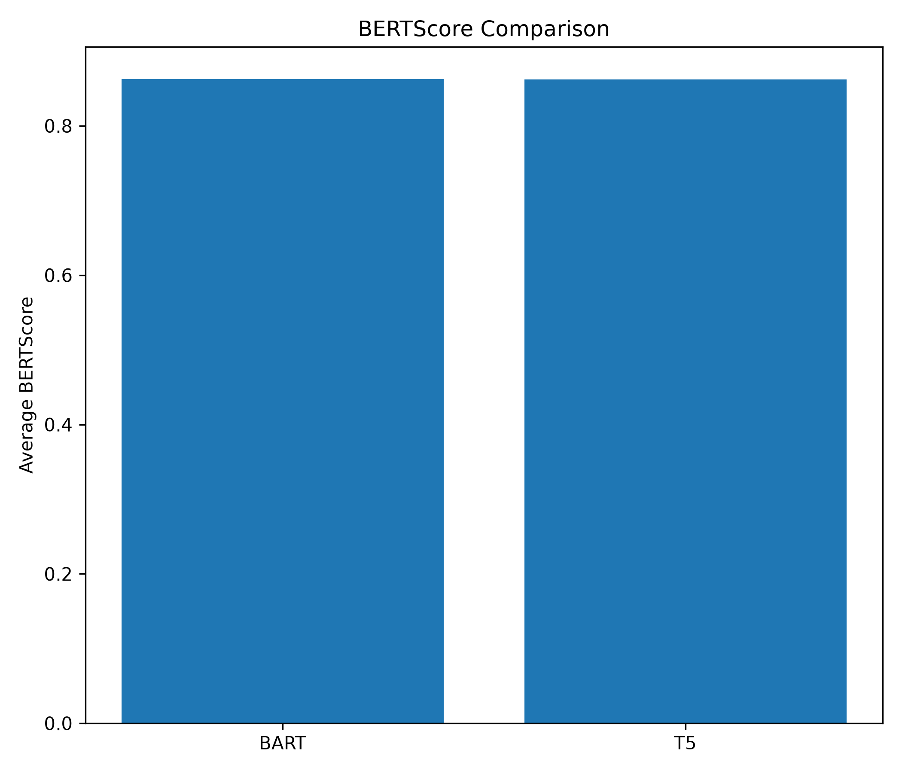
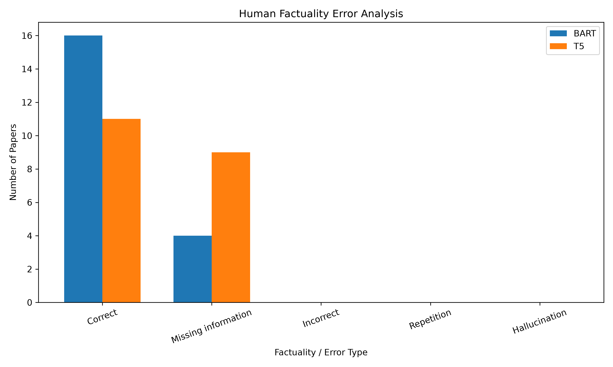
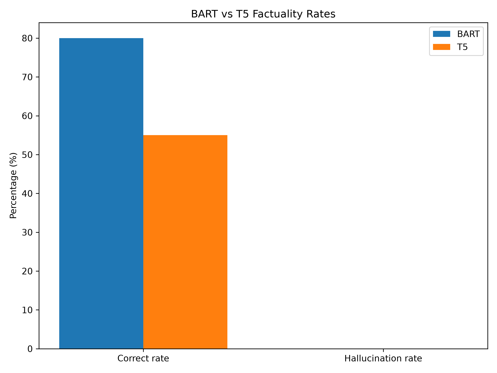
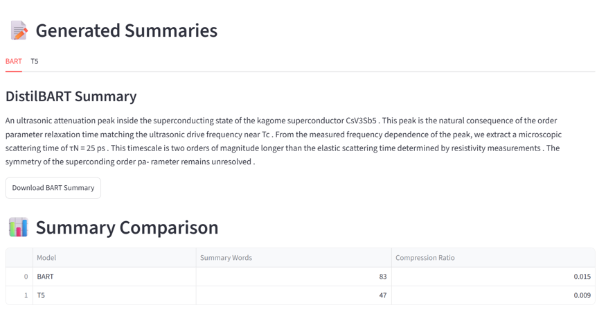
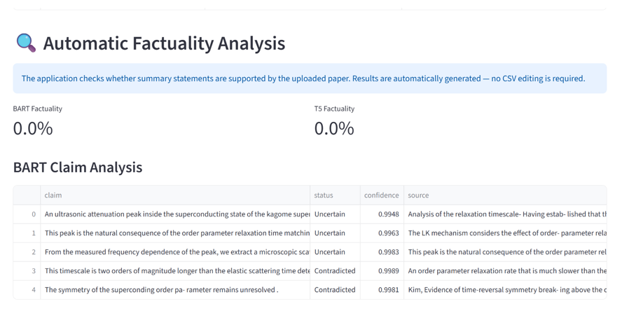
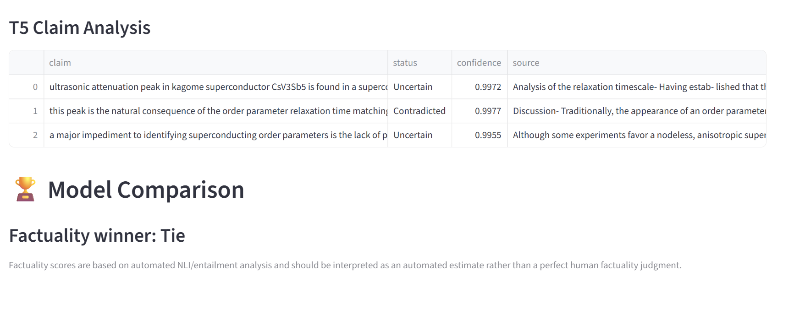
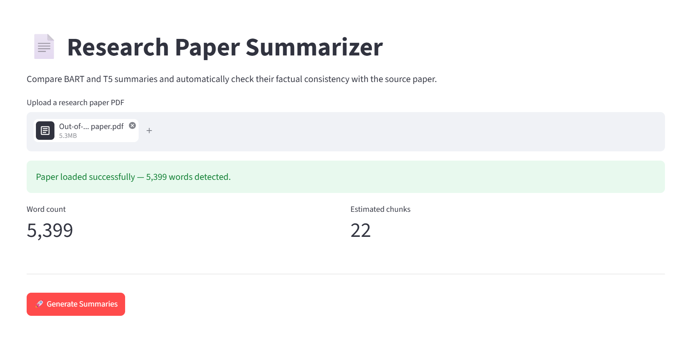

# A Comparative Study of BART and T5 for Scientific Text Summarization

A research-oriented scientific text summarization system that compares **DistilBART** and **T5** for generating summaries of research papers. The project evaluates the models using **ROUGE**, **BERTScore**, and **automated NLI-based factuality analysis**.

---

## Features

- Extracts text from research paper PDFs using PyMuPDF.
- Splits long documents into manageable text chunks.
- Generates summaries using DistilBART and T5.
- Uses hierarchical summarization for longer research papers.
- Compares summaries generated by both models.
- Evaluates summaries using ROUGE-1, ROUGE-2, and ROUGE-L.
- Measures semantic similarity using BERTScore.
- Performs automated factuality analysis using Natural Language Inference (NLI).
- Classifies summary claims as **Supported, Contradicted, or Uncertain**.
- Displays summaries, factuality results, and comparison statistics through a Streamlit interface.
- Allows generated summaries to be downloaded.
- Generates research graphs and evaluation reports.

---

## How It Works

The project contains two related workflows: a **research evaluation pipeline** and a **user-facing summarization pipeline**.

### Research Workflow

```text
SciTLDR-AIC Test Set
        |
        v
20 Scientific Papers
        |
        v
Text Processing & Chunking
        |
        +------------------+
        |                  |
        v                  v
    DistilBART             T5
        |                  |
        v                  v
Generated Summaries
        |
        +------------------+
        |                  |
        v                  v
      ROUGE            BERTScore
        |                  |
        +--------+---------+
                 |
                 v
        Factuality Analysis
                 |
                 v
          Model Comparison
                 |
                 v
          Research Results
```

### User Pipeline

```
Upload Research Paper
        |
        v
    Text Extraction
        |
        v
       Chunking
        |
        +------------------+
        |                  |
        v                  v
    DistilBART             T5
        |                  |
        v                  v
   BART Summary       T5 Summary
        |                  |
        +--------+---------+
                 |
                 v
        Summary Comparison
                 |
                 v
        Factuality Analysis
                 |
                 v
          Results Display
```

## Research Methodology

The research experiment uses the SciTLDR-AIC scientific summarization dataset.

The experiment evaluates 20 papers from the test set using:

ROUGE-1
ROUGE-2
ROUGE-L
BERTScore
Factuality analysis

The research evaluation and user-facing application are treated as separate workflows. The research pipeline is used to compare model performance, while the application allows users to summarize their own research papers.

### Research Pipeline

```
SciTLDR-AIC Test Set
        |
        v
20 Scientific Papers
        |
        v
Text Extraction
        |
        v
Text Chunking
        |
        +------------------+
        |                  |
        v                  v
    DistilBART             T5
        |                  |
        v                  v
Generated Summaries
        |
        +------------------+
        |                  |
        v                  v
      ROUGE            BERTScore
        |                  |
        +--------+---------+
                 |
                 v
        Factuality Analysis
                 |
                 v
          Model Comparison
```

## Models Used

| Component           | Model                                | Purpose                                                       |
| ------------------- | ------------------------------------ | ------------------------------------------------------------- |
| BART Summarization  | `sshleifer/distilbart-cnn-12-6`      | Generates scientific text summaries                           |
| T5 Summarization    | `t5-small`                           | Generates summaries for comparison with DistilBART            |
| Factuality Analysis | `cross-encoder/nli-deberta-v3-small` | Evaluates whether summary claims are supported by source text |


### BART

**DistilBART** is used as the first summarization model. It processes the extracted research paper text in chunks and generates a summary for each chunk. The chunk summaries are then combined to create the final summary.

### T5

**T5-small** is used as the second summarization model. It follows a text-to-text approach and is evaluated against BART to compare their summarization performance.

### NLI Model

**DeBERTa NLI** is used for automated factuality analysis. Each generated summary is divided into individual claims and compared with relevant sentences from the original research paper.

The claims are classified into:

- **Supported** — the source text supports the claim.
- **Contradicted** — the source text conflicts with the claim.
- **Uncertain** — sufficient evidence could not be established.

```text
Research Paper
      |
      v
   Chunking
      |
      +------------------+
      |                  |
      v                  v
    BART                T5
      |                  |
      v                  v
BART Summary        T5 Summary
      |                  |
      +--------+---------+
               |
               v
       Factuality Analysis
               |
               v
          NLI Model
               |
       +-------+-------+
       |       |       |
       v       v       v
   Supported  Contradicted  Uncertain
```

## Evaluation

The summarization models are evaluated using **ROUGE**, **BERTScore**, and **automated factuality analysis**.

### ROUGE

ROUGE (Recall-Oriented Understudy for Gisting Evaluation) measures the overlap between the generated summary and the reference summary.

The project uses:

- **ROUGE-1** — overlap of individual words (unigrams).
- **ROUGE-2** — overlap of two-word sequences (bigrams).
- **ROUGE-L** — similarity based on the longest common subsequence.

Higher ROUGE scores indicate greater similarity between the generated summary and the reference summary.

```text
Generated Summary
        |
        v
   ROUGE Evaluation
        |
   +----+----+
   |    |    |
   v    v    v
 ROUGE-1 ROUGE-2 ROUGE-L
```

### BERTScore

BERTScore measures semantic similarity between generated summaries and reference summaries using contextual embeddings.

Unlike ROUGE, which focuses on lexical overlap, BERTScore evaluates similarity based on contextual meaning.

### Factuality Analysis

Factuality analysis examines whether the information generated in the summary is supported by the original research paper.

The project uses **NLI-based analysis** in the user-facing application to classify claims into:

- **Supported** — The claim is supported by the original paper.
- **Contradicted** — The claim conflicts with information in the original paper.
- **Uncertain** — The available evidence is insufficient to determine whether the claim is supported.

The research analysis also categorizes observed summary behavior into:

- **Correct** — Information is accurately represented from the source.
- **Missing Information** — Important information from the source is omitted.
- **Incorrect** — Information is inaccurately represented.
- **Repetition** — The same information is unnecessarily repeated.
- **Hallucination** — Information is generated that is not supported by the original paper.

## Dataset

The research experiment uses the **SciTLDR-AIC** dataset for scientific text summarization.

The dataset contains scientific research papers along with reference summaries that are used to evaluate the generated summaries.

For this project, **20 papers from the test set** are used for the comparative evaluation of BART and T5.

The dataset is used for:

- Training and development reference
- Generating summaries for evaluation
- ROUGE calculation
- BERTScore calculation
- Factuality and error analysis
- Comparing BART and T5 performance

### Dataset Structure

```text
SciTLDR-AIC/
│
├── train.jsonl
├── dev.jsonl
└── test.jsonl
```
The research experiment uses:
```
test.jsonl
    |
    v
20 Scientific Papers
    |
    +------------------+
    |                  |
    v                  v
BART                T5
    |                  |
    v                  v
Generated           Generated
Summary             Summary
    |                  |
    +--------+---------+
             |
             v
   Reference Summary
             |
      +------+------+
      |             |
      v             v
    ROUGE       BERTScore
```
### Dataset Download
The dataset is downloaded using the provided script:
```
python download_scitldr.py
```
The downloaded files are stored locally in:
```
data/scitldr/
```

## Research Results

The research experiment compares **DistilBART** and **T5** on 20 scientific papers from the SciTLDR-AIC test set.

### Automatic Evaluation

The models were evaluated using **ROUGE-1, ROUGE-2, ROUGE-L, and BERTScore**.

The detailed numerical results are stored in:

```text
results/evaluation_results_chunked.csv
```
### Figure 1 — Average Evaluation Score Comparison



### Figure 2 — ROUGE Comparison



### Figure 3 — BERTScore Comparison



### Factuality Analysis

Generated summaries were also analyzed for factual consistency using the following categories:

- Correct
- Missing Information
- Incorrect
- Repetition
- Hallucination

The detailed factuality results are stored in:

```text
results/factuality_analysis_completed.csv
```
The summarized factuality results are stored in:
```
results/factuality_summary.csv
```

### Figure 4 — Factuality Error Analysis



### Figure 5 — Factuality Rate Comparison



### Figure 7 — Generated Summaries and Model Comparison



### Figure 8 — Automatic Factuality Analysis and Claim Analysis



### Figure 9 — T5 Claim Analysis and Model Comparison



### Overall Results

The automatic evaluation produced the following average scores:
```
| Metric        |   DistilBART |           T5 |
| ------------- | -----------: | -----------: |
| ROUGE-1       | **0.262961** |     0.254181 |
| ROUGE-2       | **0.116345** |     0.073877 |
| ROUGE-L       | **0.201613** |     0.187756 |
| BERTScore     |     0.865221 | **0.867077** |
| Average Score |   **0.3615** |       0.3457 |
```
DistilBART achieves higher scores on ROUGE-1, ROUGE-2, and ROUGE-L, while T5 achieves a slightly higher BERTScore.

Based on the combined average score used in this experiment, DistilBART achieves the higher overall score.

> **Note:** The combined average score is used only for experimental comparison and should not be treated as a replacement for the individual evaluation metrics.

## User-Facing Application

The project includes a **Streamlit-based web application** that allows users to upload research papers in PDF format and generate summaries using both **DistilBART** and **T5**.



The application is designed to provide an easy way to compare the generated summaries and assess their factual consistency.

### Application Workflow

```text
Upload Research Paper
        |
        v
   Extract PDF Text
        |
        v
   Split into Chunks
        |
        +------------------+
        |                  |
        v                  v
    DistilBART             T5
        |                  |
        v                  v
  BART Summary        T5 Summary
        |                  |
        +--------+---------+
                 |
                 v
        Summary Comparison
                 |
                 v
       Factuality Analysis
                 |
                 v
          Results Display
```

## Project Structure

```text
Research Paper Summarizer 2026/
│
├── data/
│
├── results/
│
├── ANALYZE_FACTUALITY.py
├── app_demo.py
├── APP.py
├── basic_testing.py
├── CREATE_FACTUALITY_ANALYSIS.py
├── CREATE_RESEARCH_GRAPHS.py
├── DOWNLOAD_SCITLDR.py
├── EVALUATE_ROGUE.py
│
├── REQUIREMENTS.txt
│
├── test_bertscore.py
├── test_rouge.py
└── test_t5.py
```

## Technologies Used

| Technology | Purpose |
|---|---|
| **Python** | Core programming language used throughout the project |
| **Streamlit** | Builds the interactive user-facing web application |
| **PyMuPDF** | Extracts text from uploaded research paper PDFs |
| **Hugging Face Transformers** | Provides the pre-trained Transformer models |
| **DistilBART** | Generates scientific paper summaries |
| **T5** | Generates an alternative summary for model comparison |
| **DeBERTa NLI** | Performs automated factuality analysis of summary claims |
| **ROUGE** | Measures overlap between generated and reference summaries |
| **BERTScore** | Measures semantic similarity between generated and reference summaries |
| **PyTorch** | Deep learning framework used to run the Transformer models |
| **Pandas** | Handles datasets, evaluation results, and CSV files |
| **Matplotlib** | Creates research graphs and visualizations |
| **SciTLDR-AIC** | Scientific summarization dataset used for evaluation |
| **Git & GitHub** | Version control and project repository management |

## Requirements

The project requires **Python 3.10+** and the following Python packages:

```text
streamlit
pymupdf
transformers==4.57.3
torch
rouge-score
bert-score
pandas
matplotlib
sentencepiece
```

## Usage

### 1. Clone the Repository

```bash
git clone https://github.com/kavyanjali2025/Research-Paper-Summarizer
cd "A Comparative Study of BART and T5 for Scientific Text Summarization 2026"
```

### 2. Create and Activate a Virtual Environment

```
python -m venv venv
```

Windows:
```
venv\Scripts\activate
```

### 3. Install Dependencies
```
pip install -r REQUIREMENTS.txt
```

### 4. Download the SciTLDR-AIC Dataset

Run:
```
python DOWNLOAD_SCITLDR.py
```
The dataset will be stored in:
```
data/scitldr/
```

### 5. Run the Streamlit Application

Run:
```
streamlit run APP.py
```
The application will open in your browser.

### 6. Using the Application

1. Upload a research paper in PDF format.
2. The application extracts the paper text.
3. The paper is divided into smaller chunks.
4. DistilBART and T5 generate summaries.
5. The generated summaries are displayed for comparison.
6. The application performs automated factuality analysis using the NLI model.
7. Summary claims are classified as:
-  Supported
-  Contradicted
-  Uncertain
8. Summary statistics and factuality results are displayed.
9. Generated summaries can be downloaded from the application.

### 7. Reproducing the Research Experiment

To reproduce the evaluation:
```
python EVALUATE_ROGUE.py
```
To perform factuality analysis:
```
python CREATE_FACTUALITY_ANALYSIS.py
python ANALYZE_FACTUALITY.py
```
To generate research graphs:
```
python CREATE_RESEARCH_GRAPHS.py
```
The generated evaluation files and figures are saved in:
```
results/
```
## Limitations

- The study evaluates only **20 papers from the SciTLDR-AIC test set**, so the results may not generalize to all scientific papers or domains.
- The summarization quality depends on the capabilities of the pre-trained **DistilBART and T5** models.
- Long research papers are processed using **text chunking**, which can result in some loss of context between different sections.
- **ROUGE and BERTScore** measure similarity between generated and reference summaries but do not directly determine whether a summary is factually correct.
- The NLI-based factuality analysis provides an **automated estimate** of factual consistency and may not detect every factual error or hallucination.
- The current factuality pipeline uses source-sentence retrieval based on textual similarity, which may not always identify the most relevant evidence for a claim.
- Processing long research papers and multiple Transformer models can require significant computational resources, particularly on CPU.
- The current system primarily processes the **text extracted from PDFs** and does not perform specialized analysis of scientific figures, tables, or other visual content.

## Future Work

- Evaluate DistilBART and T5 on a **larger and more diverse collection of scientific papers**.
- Experiment with larger and more advanced Transformer-based summarization models.
- Investigate **long-context summarization models** to reduce information loss during chunking.
- Improve claim extraction and source-sentence retrieval for more reliable factuality analysis.
- Explore additional **hallucination detection and mitigation techniques**.
- Incorporate **human evaluation** alongside automatic evaluation metrics.
- Improve processing of scientific **tables, figures, equations, and structured content**.
- Optimize model inference to reduce processing time and computational requirements.
- Extend the application to additional scientific domains and document formats.

## Conclusion

This project presents a comparative study of **DistilBART and T5 for scientific text summarization** using the **SciTLDR-AIC dataset**.

The models are evaluated using **ROUGE-1, ROUGE-2, ROUGE-L, and BERTScore**, along with an automated factuality analysis to examine the types of errors present in generated summaries.

The experimental results show that **DistilBART achieves higher ROUGE-1, ROUGE-2, and ROUGE-L scores**, while **T5 achieves a slightly higher BERTScore**. The factuality analysis provides an additional perspective on the factual consistency and error patterns of the generated summaries.

The project also includes a **Streamlit-based application** that allows users to upload research papers, generate summaries using both models, compare their outputs, and perform automated factuality analysis.

Overall, the study demonstrates a practical approach to evaluating scientific text summarization using both **automatic similarity metrics and factuality analysis**, while also identifying areas for further research and improvement.


